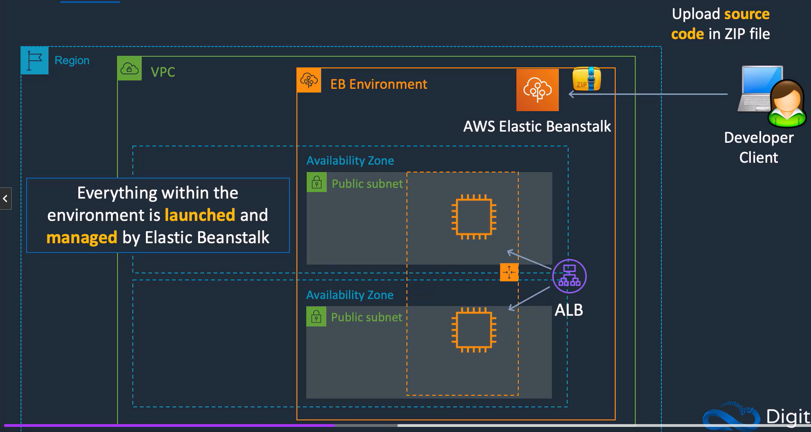
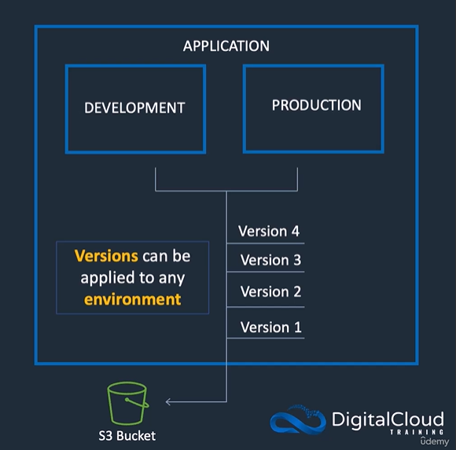
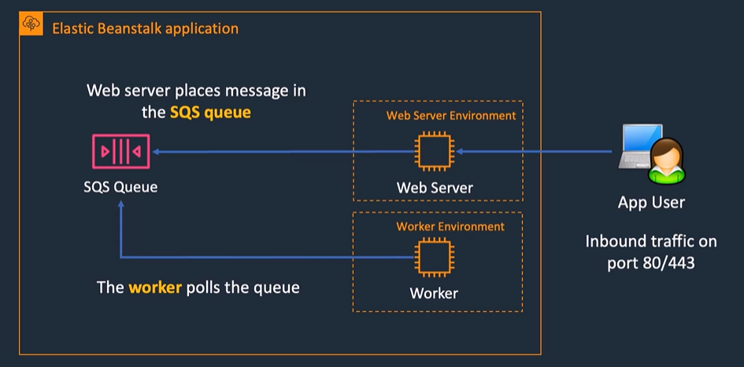

## Infrastructure as Code with AWS CloudFormation

## Platform as a Service with AWS Elastic Beanstalk

### AWS Elastic Beanstalk
- Supports many application platforms including: java, .NET, Node.js, PHP, Python, GO and Docker
- Uses core AWS services including EC2, ECS, Auto Scaling, and Elastic Load Balancing
- Elastic Beanstalk porvides a UI to monitor and manage the health of applications
- Managed platfrom updates deploy the lastest versions of software and patches

There are several layers
> **Applications**:
> - Contain environments, environment configurations, and application versions
> - You can have multiple application versions held within an application

> **Application version**
> - A specific reference to a section of deployable code
> - the application version will point typically to an Amazon S3 bucket containg the code

> **Environments**:
> - An application version that has been deployed on AWS resources
> - The resources are configured and provisioned by AWS Elastic Beanstalk
> - The environment is comprised of all the resources created by Elastic Beanstalk and not just an EC2 instance with your uploaded code

> **Web Servers** are standard applications that listen for and then process HTTP requests, typically over port 80
> **Workers** are specialized applications that have a background processing task that listens for messages on an Amazon SQS queue
> **Workers** should be used for long-running tasks

