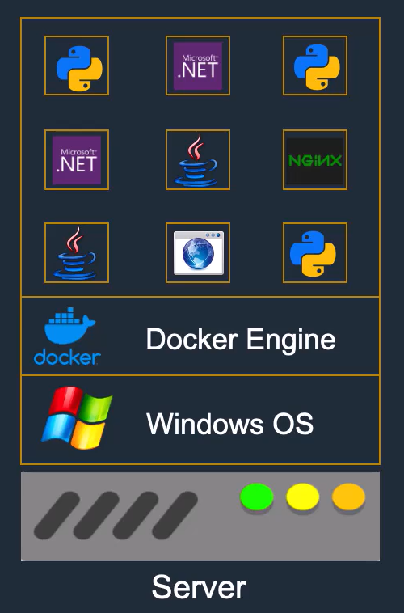
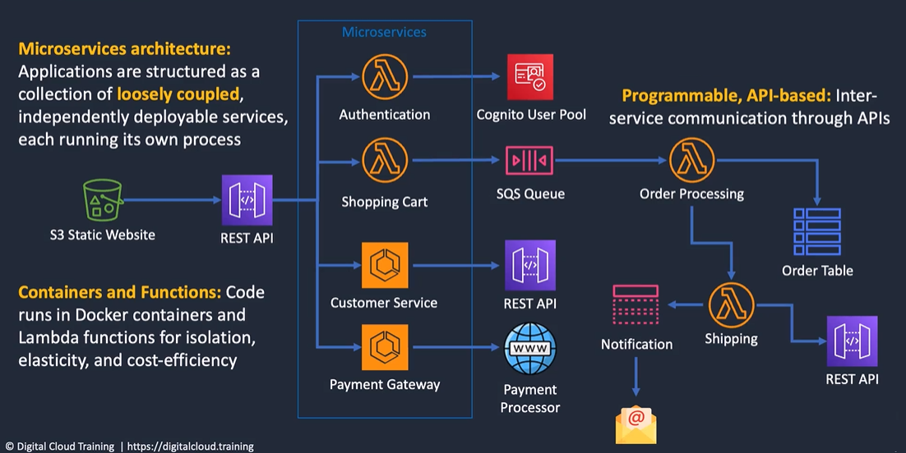
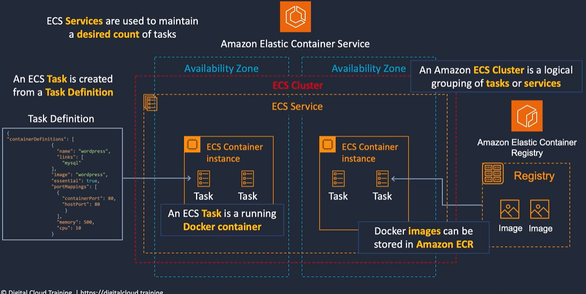
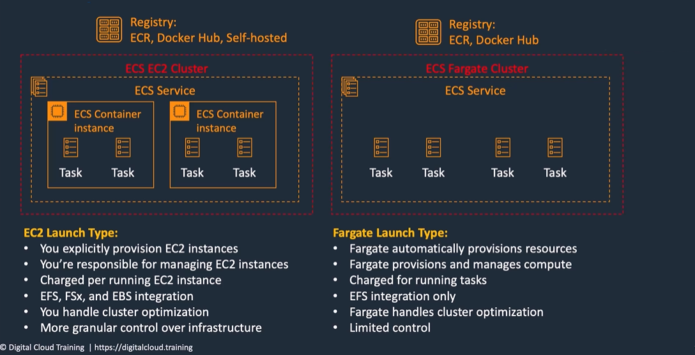
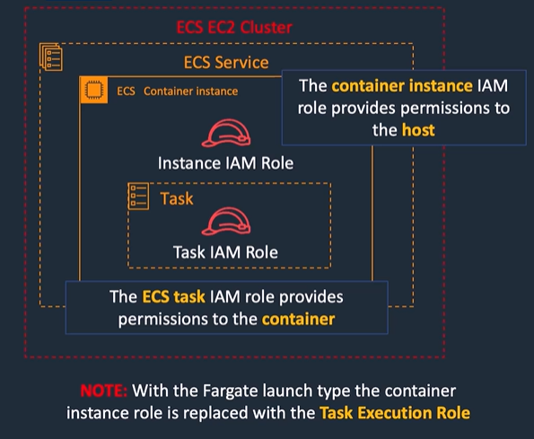
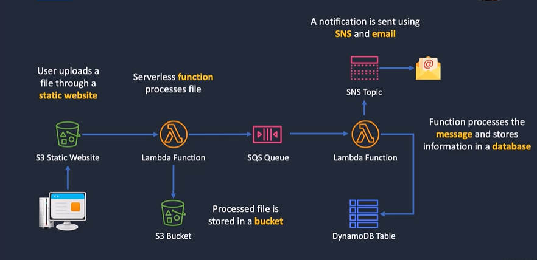
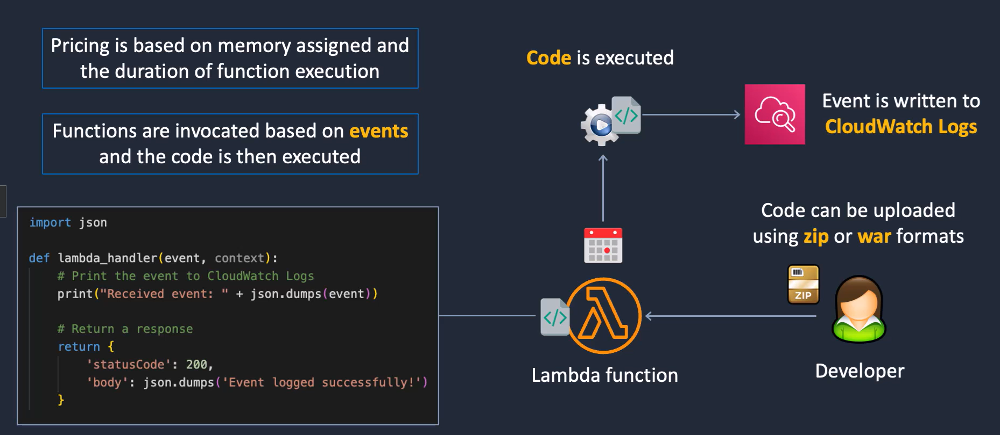
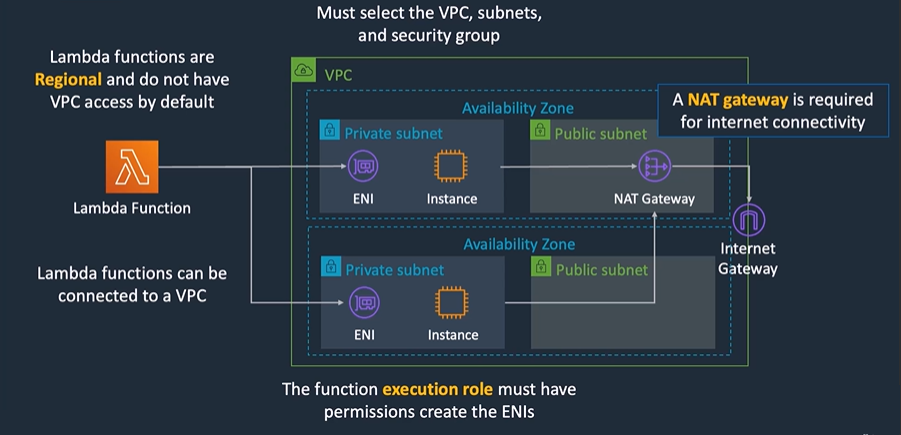

## Docker Containers and Microsoftservices  

> Every VM/instance need an **operating system** which uses significant resources  
> A **container** includes all the code, settings and dependecies for running the application  
> Each container is **isolated** from other containers  
> Containes are very resource **efficient**  
> Containers **start** up very quickly  

  

- Docker utilizes containerization to package an application and its dependencies into a single container image
- Docker provides Docker Hub, a cloud-based registry service for sharing container images and automating workflows
- Containers are lightweight because they share the host system's kernel
- Docker is ideal for microservices architectures and building cloud-native applications  

## Cloud-Native Applications

## Microservices: Attributes and Benefits

|   Microservices Attribute               |                             Microservices Benefit                                                            |
|:----------------------------------------|--------------------------------------------------------------------------------------------------------------|
| use of APIs                             | Easier integrations between application components; assists with lose coupling                               |
| Independently deployable blocks of code | Can be scaled and maintained independently                                                                   |
| Business-oriented architecture          | Development organized around business capabilities; teams may be cross-functional and services may be reused |
| Flexible use of technologies            | Each microservice can be written using different technologies (e.g. programming languages)                   |
| Speed and agility                       | Fast to deplo and update.Easy to include high availability and fault tolerance for each microservice         |

## Amazon ECS 

  

### Amazon ECS key Features  

- Serverless with AWS Fargate - managed for you and fully scalable 
- Fully managed container orchestration - control plane is managed for you  
- Docker support - run and manage Docket containers with integration into the Docker Compose CLI  
- Windows container support - ECS supports management of Windows containers  
- Elastic Load Balancing integration - distribute traffic across containers using ALB or NLB  
- Amazon ECS Anywhere- enables the use of Amazon ECS control plane to manage on-premises implementations  

### Amazon ECS Components
> cluster - logical grouping of tasks or services  
> Container instance - EC2 instance running the ECS agent  
> Task Definition - Blueprint that describes how a docker container should launch  
> Task - A running container using settings in a task definition  
> Image - A Docker image referenced in the task definition  
> Service - Defines long running tasks - can control task count with Auto Scaling and attach and ELB  

### Amazon ECS Images
- Containers are creaed from a read only template called an image which has the instructions for creating a Docker container  
- Images are built from a Dockerfile   
- Only Docker containers are supported on ECS  
- Images are stored in a registry such as DockerHub or Amazon Elastic Container Registry(ECR)  
- ECR is a manged AWS Docker registry service that is secure, scalable and reliable  
- ECR support private Docker repositories with resource-based permissions using AWS IAM in oder to access repositories and images  
- You can use the Docker CLI to push, pull and manage images  

### Amazon ECS Tasks and Task Definations
- A task definition is required to run Docker containers in Amazon ECS  
- A task defination is a text file in JSON fromat that describes one or more containers, up to maximum of 10  
- Task definitions use Docker images to launch containers  

### Launch Types -EC2 AND Fargate

### ECS and IAM Roles

## Serverless Services

- With severless there are no instances to manage   
- You dont need to provision hardware  
- There is no management of operating systems of software  
- Capacity provisioning and patching is handled automatically  
- Provides automatic scaling and high availability  
- Can be very cheap!  

### AWS Lambda

- Languages - Lambda natively supports Java, Go, PowerShell, Node.js, C#, Python and Ruby code   

- Ececuting Role(IAM Role) - this role grants the function permissions to access AWS services and resources    

- Memory and Timeout - you can specify the amount of memory allocated to a function and the maximum executing time   

- Monitoring and Logging - integrates with Amazon CloudWatch  

### Lambda Function Invocation

- Lambda fucntions run in response to events from various AWS services or direct invocation from the AWS SDKs or API  

- Functions can invoked synchronously or asynchronsouly:
 - with synchronous invocation, applications wait for the function to process the event and return a response
 - with asynchronous invocation, Lambda queues the event for processing and returns a response immediately
- Lambda scales horizontally by running multiple instances of a function in parallel, up to the concurrency limit

### Lambda to an Amazon VPC

