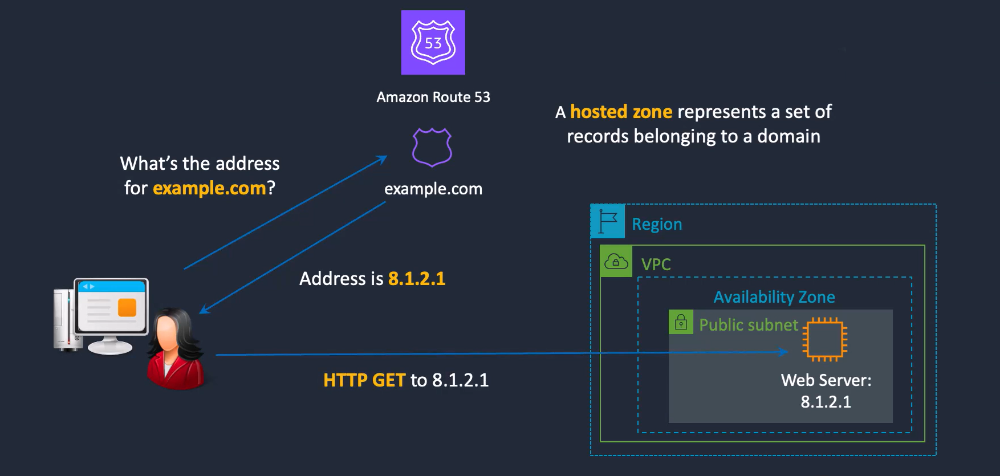
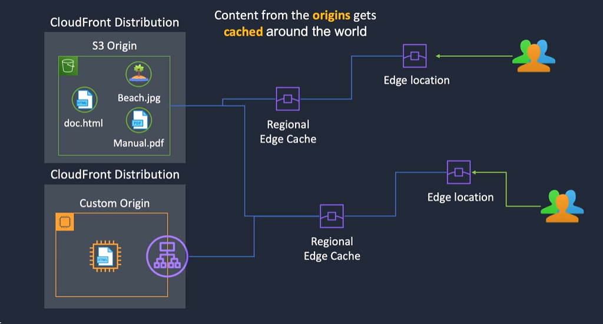

## Bandwidth   
  
> - Bandwidth is the rate of data transfer for a fixed period of time measured in Gbps  
> - Bandwith can be considered the width of the communication band

## Latency
  
> - Latency is the amount of time it takes to send data from one point to another measured in microseconds or milliseconds    
> - Greater distance = higher latency  
  
Factors that contribute to network latency include:    
- Propagation Delay: the time it takes for the signal to travel from souce to destination (primarily determined by distance)    
- Transmission Delay: the time required to push all the packets bits the wire,which depends on the packet size and the data rate of the link(bandwith)  
- Queueing Delay: the time a packet spends waiting in a queue until it can be processed or transmitted  
- Processing Delay: the time routers or switches take to process the packet  

## The Domain Name System(DNS)
 www.example.com.  
> The root domain is represented by a "." and is not usually visible in a DNS name   
> **com** is an example of a Top-Level Domain  
> **Example** is a subdomain  
> **www** is a hostname within the example subdomain 

Support.amazon.com.  
mail.google.com.  
> **support** is a subdomain of amazon.com
> **mail** is a subdomain of google.com
> A **subdomain** is subdivision of a domain name for organizing a set of related resources or services

## DNS Zones and Records
  
| Record Type |                                   Description                                          |
|------------:|----------------------------------------------------------------------------------------|
|A            | Maps a domain name to an IP address (e.g. dctlabs.com to 54.23.23.43)                  |
|CNAME        | Maps a domain name to another domain name (e.g. mail.dctlabs.com to mailserver1.net)   |
|MX           | Returns the mail servers for a domain name                                             |
|TXT          | Associates text with a domain name (used for verification, authorizations etc.)        |
|SRV          | Maps a domain name to a specific service or protocol (e.g. a kerberos server)          |
|NS           | Specifies the authoritative DNS servers for a particular domain                        |
|SOA          | Start of Authority record stores important information about the domain                |

  

## Route 53 Routing Polices  
  
|   Routing Policy  |                               what it does                                         |
|------------------:|------------------------------------------------------------------------------------|
|       Simple      |Simple DNS response providig the IP address associated with a names                 |
|      Failover     |  If primary is down(based on health checks), routes to secondary destination       |
|    Geolocation    | Uses geographic location client is in (e.g. Europe) to route to the closest region |
|   Geoproximity    | Routes to the closest region within a gerographic area                             |
|      Latency      | Directs based on the lowest latency route to resources                             |
| Multivalue answer | Returns several IP addresses and functions as a basic load balancer                |
|     Weighted      | uses the relative weights assigned to resources                                    |
|     IP based      | Route based on the originating IP address of the traffic                           |  
  
## Content Delivery Network (CDN)

> Video is uploaded to youtube  
> The video is copied to edge locations around the world
> Viewers are connected to the closest edge location
> CDNs improve performance by caching content closer to users

## Amazon CloudFront
  
   
   
- CloudFront utilizes the AWS Global Network for low latency, high performance connectivity  
- Delivers static and dynamic content and optimizes delivery    
- Supports live streaming and video on demand (VOD)  
- Lambda@Edge enables processing data with Lambda functions closer to users  
- Uses HTTPS and integrates with AWS ACM for managing SSL/TLS certificates  
- Integrates with AWS Shield and AWS WAF for additional security protection  
- Content can also be protected with features including signed cookies, signed URLs, and origin access identiy (OAI)

